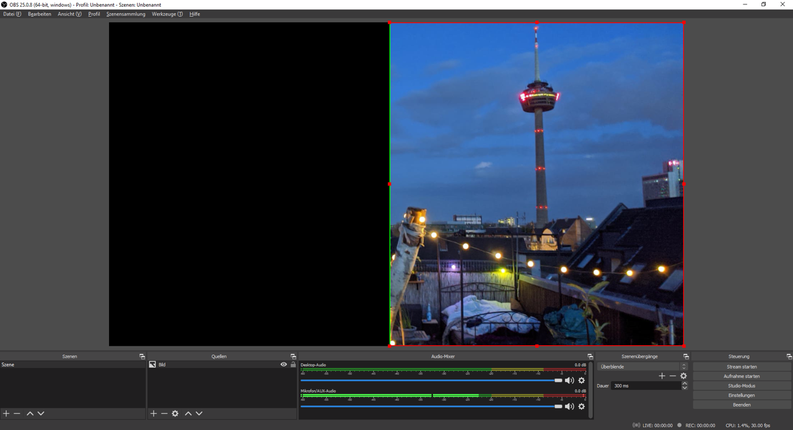
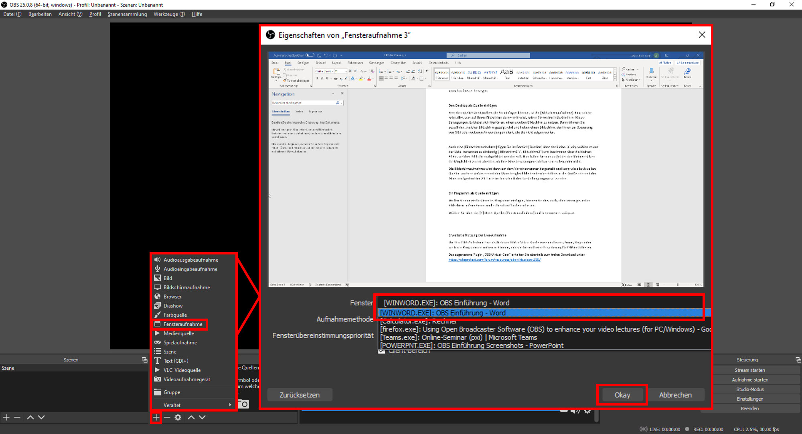
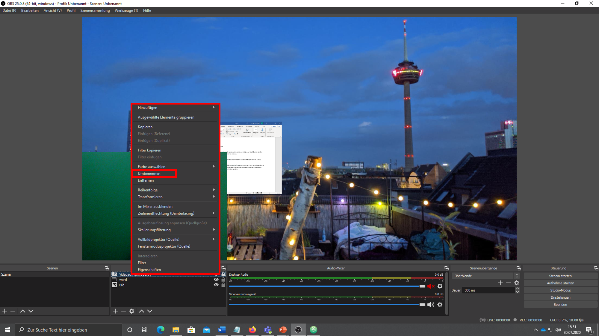
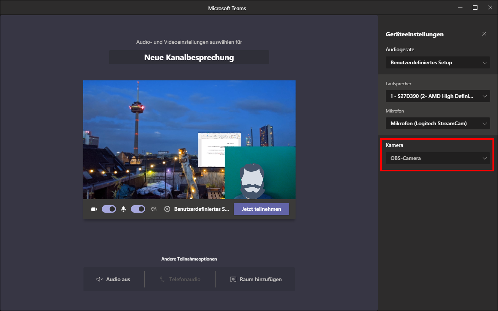

## OBS Einführung

Open Broadcaster Software, kurz OBS, ist ein frei erhältliches Open-Source-Programm, mit dem Sie Videos aufzeichnen live online in einem Stream verbreiten können.

Die Videos können aus Kamera- oder Bildschirm-Aufnahmen bestehen. Sie können also alles integrieren, was Sie auf Ihrem Bildschirm nutzen und sehen. Das funktioniert auch, wenn Sie Programme wie PowerPoint oder Browser aufzeichnen und mit Ihren eigenen Webcam-Bildern und Audio-Aufzeichnungen kombinieren. Sowohl live als auch geplant als Aufnahme.

Als Ausrüstung benötigen Sie einen Computer (bevorzugt Windows), ein Mikrofon und eine Kamera. Um eine verbesserte Audio- und Video-Qualität zu erreichen, empfehlen wir Ihnen, auf ein externes Mikrofon oder ein Headset sowie eine qualitativ hochwertigere Webcam zurückzugreifen. Zur Not tut es aber auch die Hardware, die in einem Laptop bereits integriert ist.
Für einen optimalen Einsatz von OBS raten wir zu einem zusätzlichen Monitor, der die Steureung der Videokomposition deutlich vereinfacht.

## Und los gehts

Das frei erhältliche Programm können Sie ohne Anmeldung auf der Seite https://obsproject.com/de herunterladen. Hier müssen Sie zunächst auswählen, für welches Betriebssystem Sie OBS verwenden wollen.

Nachdem Sie die Installations-Datei heruntergeladen haben, starten Sie den Installations-Prozess nach Anweisung.

Nach erfolgreicher Installation öffnen Sie das Programm OBS. Bei einem ersten Start wird Ihnen angeboten, den Autokonfigurations-Assistenten zu nutzen. Klicken Sie hier auf [Ja].

Geben Sie nun zur Verwendung an, OBS [Für das Aufnehmen optimieren, Streamen ist zweitrangig].

Der Konfigurations-Assistent wird Ihre Video-Einstellungen analysieren und die für Ihr System optimalen Einstellungen treffen. Sie können bei den Video-Einstellungen also einfach auf [Weiter] klicken und im Folgenden die [Einstellungen anwenden]. Sollten Sie diese Auswahl dennoch manuell treffen wollen, ist als [Basis-(Leinwand-)Auflösung] [Aktuelle verwenden] und als [FPS] die niedrigste Auswahl [30] ausreichend.

Sofern gewünscht, können Sie den Autokonfigurations-Assistenten über den Reiter [Werkzeuge] auch später erneut nutzen und Einstellungen anpassen, oder für Streaming anstelle von Aufnahmen optimieren.

## Aufbau der Nutzungs-Oberfläche von OBS

Um mit dem Programm OBS leicht zurechtzukommen, reicht eine Übersicht von dessen grundlegenden Funktionen und des optischen Aufbaus:

1.	Vorschaufenster: Hier wird Ihnen angezeigt, was in Ihrer Aufnahme oder Live-Übertragung effektiv dargestellt wird. Beim ersten Öffnen des Programms wird dieser Bereich schwarz dargestellt, da Sie noch keine Inhalte wie Bilder, Videos, Webcams, Browser-Darstellungen, Präsentationen, Bildschirm-Aufnahmen oder weiteres eingefügt haben. All diese Inhalte, die Sie darstellen und aufzeichnen wollen, werden Quellen genannt.
2.	Quellen: In diesem Bereich können Sie Quellen, also Inhalte, als einzelne Elemente hinzufügen. Hierüber zugefügte Elemente werden schließlich im großen Vorschaufenster angezeigt. Neben visuellen Quellen fügen Sie hier auch Audio-Quellen hinzu.
3.	Szenen: Szenen können als optische Vorlagen betrachtet werden, denn in diesem Bereich können Sie verschiedene optische Arrangements Ihrer eingefügten Quellen speichern und immer wieder darauf zugreifen. Haben Sie mehrere Quellen eingefügt, können Sie diese in Ihrem Vorschaufenster nach Ihren Vorstellungen anordnen und als Szene speichern. Soll etwa Ihr Webcam-Bild als kleines Fenster unten links vor einer Präsentation erscheinen, so können Sie sich diesen Aufbau im Vorschaufenster zurechtlegen, als Szene speichern und später immer wieder verwenden. 
4.	Audio Mixer: Hier wird Ihnen angezeigt, ob Audio-Elemente wie Mikrofon-Aufzeichnungen in OBS ankommen. Bewegungen der farblichen Balken zeigen an, ob die Audio-Ausgabe zu laut oder zu leise ist. Außerdem können Sie hier ungewollte Audio-Spuren herausfiltern.
5.	Szenen-Übergänge: Dieser Bereich ist nur für die fortgeschrittene Anwendung wichtig. Hier können Sie den Wechsel zwischen mehreren angelegten Szenen gestalten.
6.	Steuerung: Hier starten und stoppen Sie Ihre Aufnahme.

## Quellen einfügen und anpassen

Quellen fügen Sie über den Bereich Quellen ein, indem Sie auf das kleine [+] klicken. Dann öffnet sich ein Auswahl-Menü für alle wählbaren Quellen-Arten.

Wählen Sie Ihre gewünschte Quellen-Art, etwa ein Bild, müssen Sie Ihrer Quelle zunächst einen Namen geben. Lassen Sie dabei die Auswahl auf [Neu erstellen]. Einmal so eingerichtet, wird diese Quelle entsprechend im Bereich Quellen angezeigt und kann später über [Existierende hinzufügen] immer wieder genutzt werden. Benennen Sie Ihre Quellen also möglichst eindeutig.

Über [Durchsuchen] können Sie ein Bild von Ihrem Computer auswählen. Bestätigen Sie dann die Auswahl mit [Okay], derweil die ausgesuchte Quelle bereits in Ihrer Vorschau dargestellt wird.

Wenn Sie Ihre Quelle im Vorschaufenster mit der Maus anwählen, wird diese mit einem roten Rand und kleinen quadratischen Anfassern markiert. Einmal markiert, können Sie Ihre Quelle mit der Maus auf eine gewünschte Größe bringen, indem Sie die an den Anfassern bei gedrückter linker Maustaste ziehen. Das Seitenverhältnis der Quelle bleibt dabei gleich.

Wollen Sie den Bildausschnitt Ihrer Quelle verändern, müssen Sie [Alt] auf Ihrer Tastatur gedrückt halten, während Sie einen Anfasser mit gedrückter linker Maustaste verschieben. Dabei wird die rote Markierung der Seite, von der aus Sie den Ausschnitt verändern, grün dargestellt.

Um die Position der Quelle zu verschieben, können Sie direkt auf die Quelle klicken und diese mit gedrückter linker Maustaste auf dem Vorschaufenster bewegen.

## Den Desktop als Quelle einfügen

Eine der Quellen, die Sie einfügen können, ist die [Bildschirmaufnahme]. Die zeigt alles, was auf Ihrem Bildschirm dargestellt wird. Sofern Sie wollen, inklusive Ihrer Maus-Bewegungen. Es bietet sich hierfür an, einen zweiten Bildschirm zu nutzen. Dann können Sie auswählen, welcher Bildschirm gezeigt wird, während Sie auf dem anderen OBS oder andere Anwendungen steuern, die Sie nicht darstellen wollen.

Auch eine [Bildschirmaufnahme] fügen Sie im Bereich [Quellen] über das [+] ein. Wählen Sie die Option aus der Liste, benennen Sie die Quelle eindeutig („Bildschirm1“/ „Bildschirm2“) und bestimmen über die Pfeile, welcher Bildschirm abgebildet werden soll. Mit einem Häkchen haben Sie die Möglichkeit, zu entscheiden, ob Ihre Mausbewegungen sichtbar sein sollen oder nicht.

Die Bildschirmaufnahme wird dann auf dem Vorschaufenster dargestellt und kann wie alle visuellen Quellen in der Darstellung angepasst werden.

## Ein Programm als Quelle einfügen

Anstatt Ihren gesamten Bildschirm im Video abzubilden, können Sie die Aufnahme auch auf einzelne Programme beschränken.

Öffnen Sie hierfür zunächst das gewünschte Programm, etwa PowerPoint, Word oder einen Browser.

Klicken Sie in OBS auf das [+] im Quellen-Menü. Wählen Sie [Fensteraufnahme] und benennen Sie diese adäquat. Unter [Fenster] können Sie nun Ihr laufendes Programm aus dem Drop-Down-Menü wählen. Die Auswahl zu [Aufnahmemethode] bleibt auf [Automatisch], [Fensterübereinstimmungspriorität] bleibt ebenso unangetastet.

## Eine Kamera einbinden

Um eine Webcam als Quelle einzubinden, klicken Sie in OBS auf das [+] im Quellen-Menü. Wählen Sie [Videoaufnahmegerät] und geben Sie eine sinnvolle Bezeichnung ein.

Unter [Gerät] wählen Sie dann Ihre Gewünschte Kamera aus und bestätigen dies mit [Okay].

Ihr Kamerabild wird Ihnen nun auf dem Vorschaufenster angezeigt. 
Jetzt können Sie es wie alle Quellen nach Ihren Vorstellungen platzieren und beschneiden.

## Anordnung der Quellen im Vorschaufenster

Wenn Sie mehrere Quellen in OBS eingefügt haben, können Sie diese anordnen, wie Sie wollen. 
Die Größe und Position jeder einzelnen Quelle können Sie mit der Maus bestimmen. 

Im Quellen-Menü werden alle eingefügten Quellen aufgelistet. Die Reihenfolge bestimmt die Ebenen, auf der sich die Quellen befinden. Wollen Sie etwa ein eingefügtes Bild im Hintergrund haben, so muss sich diese Quelle ganz unten in der Auflistung befinden; Ihre Kamera im Vordergrund entsprechend ganz oben. Mit den Pfeiltasten können Sie jede angewählte Quelle eine Ebene nach oben oder unten verschieben.

Über das Zahnrad können Sie die [Eigenschaften] der einzelnen Quellen erneut barbeiten. 
Mit dem [-] können Sie eine nicht mehr benötigte Quelle entfernen.
Über die Augensymbole neben den einzelnen Quelle blenden Sie diese ein und aus.

Mit einem Rechtsklick der Maus auf eine Quelle gelangen Sie in ein erweitertes Kontextmenü. 
Hier können Sie die Quelle unter anderem umbenennen.

## Erweiterte Nutzung der Live-Aufnahme

Mit der Installation einer Erweiterung können Sie Ihre OBS-Aufnahme anstelle Ihrer normalen Webcam-Aufnahme live in andere Programme einbinden. Beispielsweise in Video-Konferenzen über Teams, Zoom oder Skype.

Das sogenannte Plugin „OBS VirtualCam“ erhalten Sie ebenfalls zum freien Download:  https://obsproject.com/forum/resources/obs-virtualcam.539/

Klicken Sie dort auf [Go to Download], speichern Sie den darauf erscheinenden Downloader und starten die Installation von VirtualCam.
(Den direkten Download ohne Installer und inkl. 32/64-Bit-Auswahl finden Sie hier: https://github.com/CatxFish/obs-virtual-cam/releases)

Nach erfolgreicher Installation und einem Neustart von OBS finden Sie in OBS unter [Werkzeuge] IHre [VirtualCam]. Klicken sie auf [Start] und die VirtualCam zeichnet auf. Das Kontrollkästchen der VirtualCam bleibt dabei stets offen und kann nicht minimiert werden. Bei laufender Cam wird der [Start]-Knopf ausgegraut dargestellt.

Ab diesem Moment haben Sie in vielen Programmen die Möglichkeit, [OBS-Camera] als Kamera auszuwählen. Meist finden Sie diese Option in den [Geräteeinstellungen] der jeweiligen Programme wie MS Teams oder Zoom. Statt Ihrer normalen Webcam bildet die ausgewählte [OBS-Camera] dann alles ab, was Sie in OBS in Ihr Vorschaufenster integriert haben.

