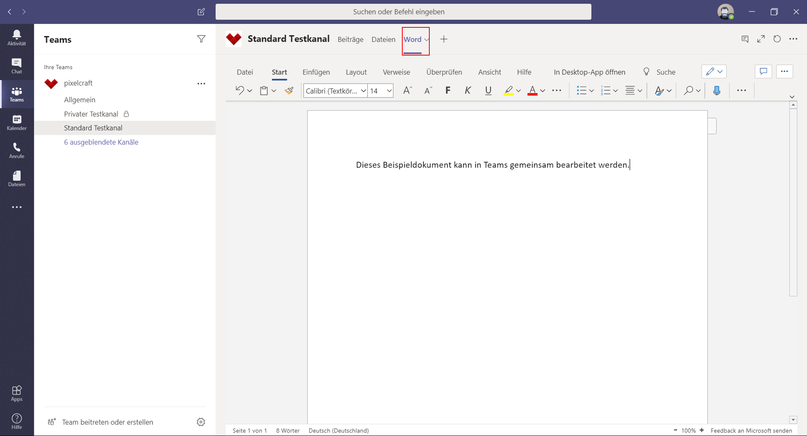
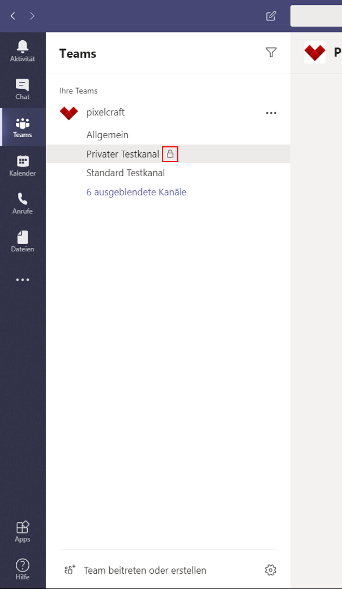

## Kanäle [anleitung-kanaele-20200907]

MS Teams Einsatzfelder zeichnen sich im Wesentlichen durch drei Pfeiler aus: Kommunikation, Kollaboration und Dateiverwaltung. Diese Pfeiler stehen auf dem Fundament von Teams, den [Kanälen].

[Kanäle] sind spezielle Bereiche innerhalb eines [Teams]. Hiervon stehen jedem Team 200 [Standardkanäle] und 30 sogenannte [private Kanäle] zur Vµerfügung.

Ein [Kanal] gibt dabei den Personenkreis oder thematischen Rahmen vor. Hier können Sie aufteilen und bestimmen, wer Zutritt hat, wer Informationen erhält, wer Zugriff auf Dateien hat und welche  spezifischen Apps und Tabs verfügbar sind.

Jedes [Team] startet mit einem Hauptkanal [Allgemein]. Dieser wird automatisch bei Gründung eines neuen [Teams] angelegt und kann weder gelöscht noch umbenannt werden.
Für jedes [Team] können Sie weitere [Kanäle] hinzufügen und zweckmäßig benennen. Etwa für bestimmte Projekte oder als Arbeitsumgebung für einen ausgewählten Personenkreis.

Sie können die [Kanäle] in der App zur verbesserten Übersicht sortieren: Mit gehaltener Maustaste lassen sie sich verschieben, über das Kontextmenü [Weitere Optionen] auch anheften.
Benötigen Sie einen [Kanal] nicht mehr, können Sie diesen löschen. Dabei bleiben die dort geteilten Dateien auf der zum [Kanal] gehörigen SharePoint-Team-Seite gespeichert, die darin geführten Unterhaltungen gehen jedoch verloren.

Ein [Kanal] besteht aus Tabs beziehungsweise Registrierkarten, die Sie in der Menüleiste oben im [Kanal] finden und dort auch erweitern können. Jeder [Kanal] hat dabei zwei Registerkarten, die dauerhaft bestehen, also auch nicht gelöscht oder umbenannt werden können: [Beiträge] und [Dateien]. Betreten Sie einen [Kanal], ist automatisch die Registerkarte [Beiträge] geöffnet. In dieser befinden sich alle [Unterhaltungen] des [Kanals]. Es ist der direkte Ort der Kommunikation und Zusammenarbeit.

Die Registerkarte [Dateien] bietet einen übersichtlichen Zugriff auf den kanaleigenen Ordner auf dem SharePoint und somit auf alle Dateien, die von [Kanal]-Mitgliedern über [Unterhaltungen] innerhalb des [Kanals] geteilt oder direkt auf den SharePoint hochgeladen wurden.

Sie teilen eine Datei, indem diese über die Schaltfläche [Anfügen] oder über Copy-Paste in eine [Antwort] oder neue [Unterhaltung] integrieren. Der kanaleigene SharePoint-Ordner wird automatisch bei Gründung eines neuen [Kanals] erstellt und mit der [Dateien]- Registerkarte des [Kanals] verknüpft.

Für jeden [Kanal] können Sie über die Schaltfläche [+] weitere [Registrierkarten hinzufügen].

Teams bietet eine große Auswahl an Apps zur Integration an, es lassen sich jedoch auch Internetseiten und einzelne Dokumente als Registerkarte in einem [Kanal] platzieren. So sind wichtige Apps von Microsoft aber auch externen Anbietern, Internetseiten oder gemeinsam bearbeitete Word-Dokumente nur einen Mausklick entfernt und direkt in der Teams-App zu benutzen. Dabei ist jedoch zu bedenken, dass beispielsweise Word-Dokumente innerhalb der Teams-App zunächst in der Online-Ansicht dargestellt werden. Aber auch hier müssen Sie nur ein Mal auf [In Desktop-App öffnen] klicken, um in die vollständige Applikation zu wechseln.

{>>Jule: Schreib doch hier bitte "Beispiel-Dokument" oder einfach nur "Dokument" und erhöhe den Schriftgrad.<<}

[Kanäle] stehen zunächst allen Mitgliedern eines [Teams] offen. Um selektiv Mitgliedern Zugriff zu gewähren, können Sie [private Kanäle] gründen. Diese werden in der [Kanal]-Übersicht Ihres [Teams] mit einem Schloss-Symbol gekennzeichnet und nur eingeladenen Personen angezeigt. Unterhaltungen, Mitgliedslisten und eine separate Website-Sammlung auf SharePoint zur Dateiablage sind nur Mitgliedern des [privaten Kanals] zugänglich. Wer [private Kanäle] erstellen kann, lässt sich auf Team- und Organisationsebene bestimmen, es steht als Standard aber zunächst allen [Team]-Mitgliedern zu. Gäste haben hierzu keine Berechtigung.

Die Person, die einen [privaten Kanal] erstellt, kann [Team]-Mitglieder und auch Gäste nach ihrem Belieben hinzufügen. Um einen [privaten Kanal] zu erstellen, müssen Sie im Erstellungsfenster unter [Datenschutz] die Auswahl [Standard - für alle Teammitglieder zugänglich] auf [Privat - nur für bestimmte Personengruppe im Team zugänglich] ändern. {>>Jule: Was ist das "Erstellungsfenster"? Hier braucht es glaube ich eine bessere Schaltflächen-Beschreibung.<<} Anschließend können Sie erwünschte Personen hinzufügen, oder nachträglich über die [Kanal]-Schaltfläche [...] ergänzen.

[weiter lesen: Unterhaltungen](#anleitung-unterhaltungen-20200907)
