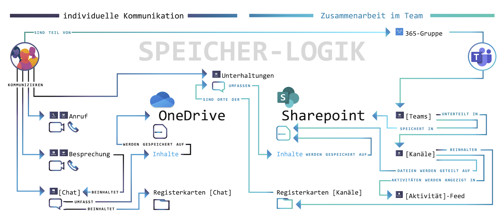
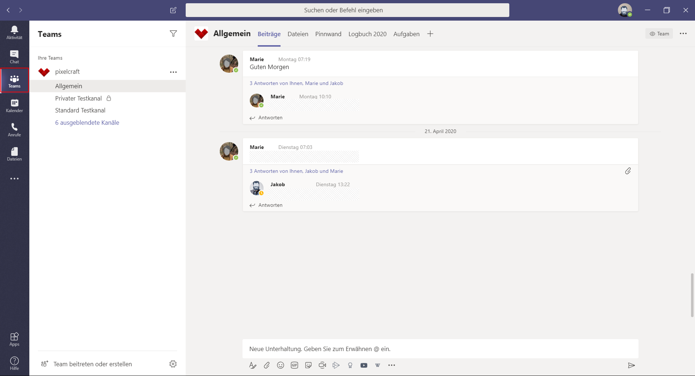
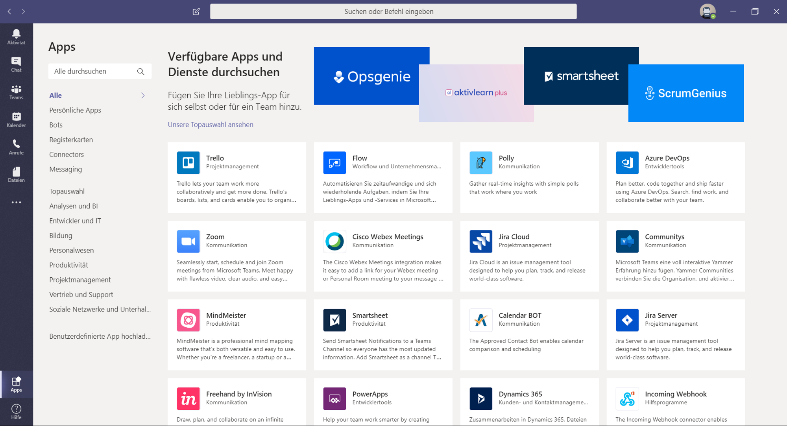
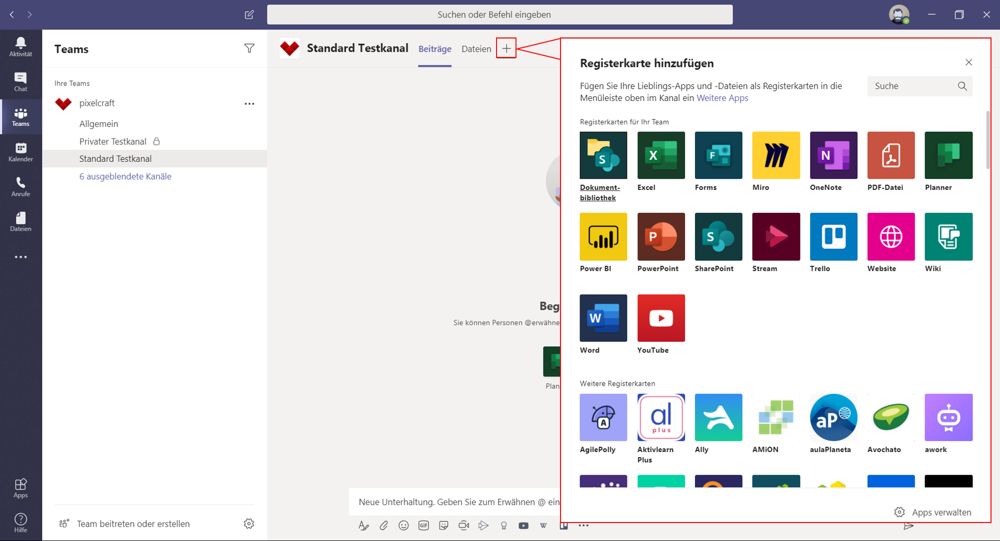
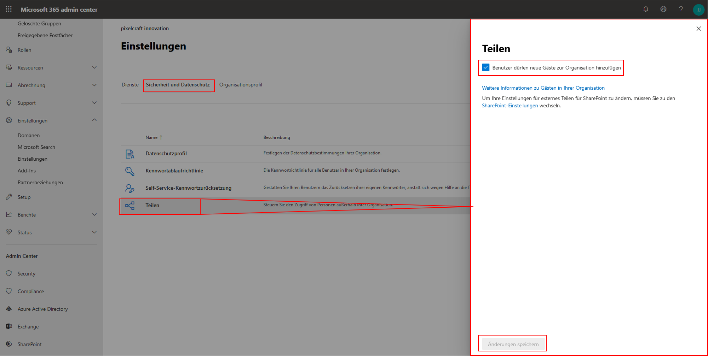
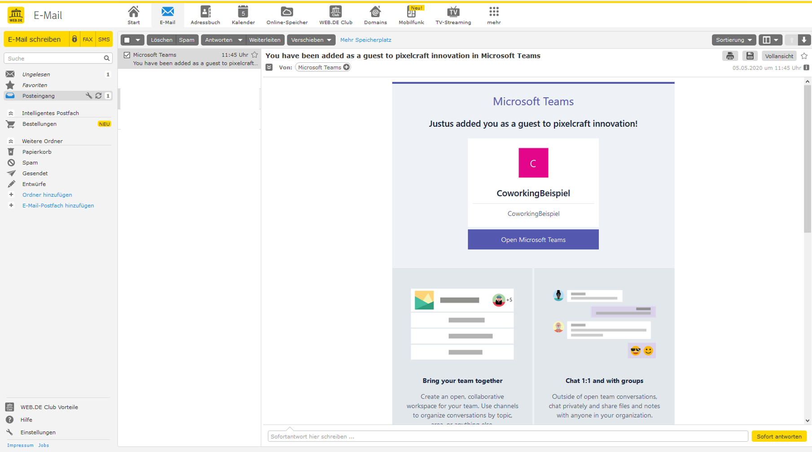
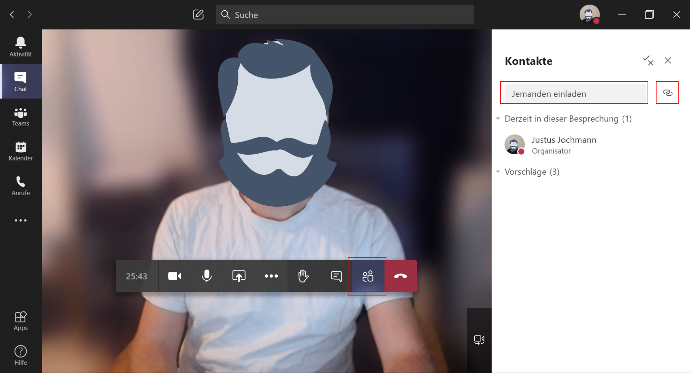

### Der Einstieg in Microsoft Teams
Wie Sie mit Microsoft Teams Kommunikationswege bündeln und mit Ihrer Belegschaft einen erfolgreichen Start planen.  
▿ *ca 10min*

- [**Wozu**](#wozu-20200907)
    - [Vorteile](#wozu-vorteile-20200907)
    - [Einführung](#wozu-einfuehrung-20200907)
    - [Verwaltung](#wozu-verwaltung-20200907)

### Der Umgang mit der Oberfläche
Wie Sie mit der Software umgehen und Produktivitäts-Gewinne erschließen.  
▿ *ca 20min*

- [**Anleitung**](#anleitung-20200907)
    - [Apps](#anleitung-apps-20200907)
    - [Kanäle](#anleitung-kanaele-20200907)
    - [Unterhaltungen](#anleitung-unterhaltungen-20200907)
    - [Chat](#anleitung-chat-20200907)
    - [Video](#anleitung-video-20200907)
    - [Benachrichtigungen](#anleitung-benachrichtigungen-20200907)
    - [Dateien](#anleitung-Dateien-20200907)

### Gastzugänge für externen Zugriff einrichten
Wie Sie Gäste von außerhalb ihrer Organisation und ohne eigenes Office-365-Konto einladen und zur Mitarbeit befähigen.
▿ *ca 10min*

- [**Gastzugang**](#gastzugang-20200907)
    - [Rechte](#gastzugang-rechte-20200907)
    - [Zugang Einrichten](#gastzugang-einrichten-20200907)
    - [Besprechungen](#gastzugang-besprechungen-20200907)

### [zurück zur Übersicht](/)

# MS Teams [intro]

Microsoft Teams ist Software, mit der Sie Dokumente und Kommunikation in gemeinsamer Arbeit verwalten können. Von kleinen Projekten bis zur Konzern-Struktur, mit allen möglichen Endgeräten und Betriebssystemen über die entsprechenden Apps.

Microsoft Teams bietet dafür einen zentralen Ort der Kommunikation, der Dateiverwaltung und Zusammenarbeit. Dieser Ort liegt als vernetzte Datenbank in der *Cloud*. Auf die dort vorgehaltenen Inhalte können Sie anderen Menschen Zugriff ermöglichen.
<label for="aside--microsoft-teams-bietet" class="aside-toggle" role="button" aria-pressed="false" aria-label="Randbemerkung anzeigen" onkeypress="toggleButtonKeyPress()" onclick="toggleButtonClick()" tabindex="0">⨭ …</label>

<input id="aside--microsoft-teams-bietet" type="checkbox" class="aside-toggle"/>

**Notiz**: Die *Cloud* ist eigentlich nur ein Computer, den jemand als Dienstleistung für Sie verwaltet. Extra für eine besondere Anwendung eingerichtet, so dass Sie über das Internet darauf zugreifen können.

<label for="aside--dieser-leitfaden-bietet" class="aside-toggle" role="button" aria-pressed="false" aria-label="Randbemerkung anzeigen" onkeypress="toggleButtonKeyPress()" onclick="toggleButtonClick()" tabindex="0">⨭ …</label>

<input id="aside--dieser-leitfaden-bietet" type="checkbox" class="aside-toggle"/>

**Download**: Die Architektur von Teams als Poster. <a href="teams-architektur.pdf">PDF, Din A1 </a>

Ein so mächtiges Werkzeug zur Verwaltung von Zugriffsrechten und Kommunikation braucht ein wenig Eingewöhnung — aber wer einmal die Logik dahinter verstanden hat, kann schnell und intuitiv damit arbeiten.

Dieser Leitfaden bietet dazu die Einführung.

Microsoft Teams ermöglicht mit der Struktur von Inhalten und Dateien anhand von **[Teams]** und deren **[Unterhaltungen]** einen reibungslosen Wechsel zwischen dem Büro zu Hause und in der Firma. Auch Menschen außerhalb einer Organisation können für einzelne Projekte mit entsprechendem Zugriff eingebunden werden.
<label for="aside--microsoft-teams-ermoeglicht" class="aside-toggle" role="button" aria-pressed="false" aria-label="Randbemerkung anzeigen" onkeypress="toggleButtonKeyPress()" onclick="toggleButtonClick()" tabindex="0">⨭ …</label>

<input id="aside--microsoft-teams-ermoeglicht" type="checkbox" class="aside-toggle"/>

**Notiz:** In diesem Leitfaden schreiben wir Begriffe, die auf einen gleich lautenden Menüeintrag in MS-Teams verweisen, in eckigen Klammern. In der App versammeln die sogenannten **[Teams]** Personengruppen, Inhalte und Werkzeuge für einzelne Projekte oder ganze Organisationen. Diese **[Teams]** lassen sich mit **[Kanälen]** noch weiter spezifizieren und aufteilen, um Projekten, Themen, Fachrichtungen oder weiteren für Sie wichtigen Aspekten noch besser gerecht zu werden.

Die Integration der Speicherorte in sogenannte **[Kanäle]** bietet ein übersichtliches digitales Arbeitsumfeld: Absprachen und Datei-Verlinkungen werden hier zu einzelnen Themen und Projekten gebündelt, so dass Sie nicht permanent zwischen Chat-Fenstern und Datei-Ordnern hin und her suchen müssen.

Microsoft Teams kann außerdem weitere Apps und Informations-Quellen in seine Oberfläche integrieren. So können Sie Arbeit und die daran anknüpfenden Informationen zentral sichtbar machen.

Microsoft Teams ermöglicht Zusammenarbeit, indem es die Absprachen zur Arbeit an Dokumenten und Inhalten in den Fokus stellt. Deswegen sieht die wichtigste Oberfläche wie ein Chat-Programm aus und eine Videokonferenz ist immer nur einen Klick entfernt. Dazu lassen sich die jeweils relevanten Arbeits-Inhalte ganz individuell einrichten.

Auch die Kommunikation und Zusammenarbeit und mit externen Personen ist möglich: Personen, die nicht zu Ihrer Organisation gehören, können auch ohne Office365-Lizenz von Ihnen in Arbeitsgruppen eingeladen werden.

[Wozu und wie mit MS Teams starten](#wozu-20200907)    
[Einführung in die Oberfläche](#anleitung-20200907)

## Wie ist Teams aufgebaut? [anleitung-20200907]

Alle wichtigen Funktionen können Sie über die Schaltflächen in der linken Spalte erreichen. Wie Sie die jeweils nutzen, erklären wir in den folgenden Abschnitten noch genau. Aber hier ist ein erster Überblick.

**[Aktivität]** - Ein Feed, der Sie chronologisch über Erwähnungen, Nachrichten, Änderungen und weitere Vorgänge in Ihren [Teams] informiert.

**[Chat]** - Ermöglicht Ihnen den schnellen Austausch mit anderen Mitgliedern.

**[Teams]** - Listet alle [Teams] auf, an denen Sie beteiligt sind. Hierüber erreichen Sie auch deren zugehörige [Kanäle].

**[Kalender]** - Hier planen und betreten Sie Besprechungen.

**[Anrufe]** - Bietet die Möglichkeit, mit anderen per Video- oder Audio-Anruf zu kommunizieren. Auch Kontakte, Verläufe und eine Art Anrufbeantworter finden Sie hier.

**[Dateien]** - Hier finden Sie alle mit Ihnen geteilten Dateien.

In der linken Spalte, unterhalb der Hauptfunktionen, können Sie noch weitere Apps für den Schnellzugriff platzieren.

Die Kopfzeile bietet auf der linken Seite eine Navigationshilfe mit Vor- und Zurückfunktion. Diese ist besonders praktisch, um schnell wieder in den Bereich zurückzukommen, aus dem Sie, beispielsweise durch einen [Chat], herausgeraten sind. Mit einem Klick auf [<] gelangen Sie wieder dorthin zurück, ohne den Umweg über die Schaltflächen [Teams] und [Kanäle] nehmen zu müssen.

In der Mitte der Kopfzeile können Sie sowohl eine allgemeine Suche als auch Befehle ausführen.

Kurzbefehle dienen dazu, allgemeine Aufgaben in Teams zu erledigen. Um diese zu verwenden, geben Sie [/] in das Befehlsfeld ein. Daraufhin öffnet sich eine Liste mit einem Überblick über mögliche Befehle und deren Wortlaut.

Mit einem vorangestellten [@] vor einem Namen können Sie im Befehlsfeld Nachrichten direkt an einzelne Personen oder geteilte [Chats] senden.

Im rechten Bereich der Kopfzeile befindet sich ein rundes Profilbild. Hier können Sie all Ihre grundsätzlichen Einstellungen anpassen. Zum Beispiel können Sie den Status Ihrer aktuellen Erreichbarkeit ändern, der anderen Mitgliedern angezeigt wird.

[jetzt lesen](#anleitung-apps-20200907)

## Wie können wir Apps in MS Teams einbinden? [anleitung-apps-20200907]

Teams zeichnet die Offenheit für externe Apps aus: Die Wahl der kompatiblen Werkzeuge ist groß genug, um sowohl Notwendigkeiten als auch Vorlieben und Gewohnheiten gerecht zu werden. Nicht alles muss für Teams neu gelernt und verändert werden. Viele bereits funktionierende Arbeitsabläufe können Sie in Teams integrieren oder optimieren. Und so eine zentrierte, effektive Arbeitsumgebung schaffen.

Sie können unterstützte Apps und Werkzeuge in Teams aus einer umfangreichen Liste auswählen und auf verschiedenen Ebenen integrieren. Diese Ebenen sind in Microsoft Teams wie folgt aufgebaut:

Auf der linken Seite der Benutzer-Oberfläche von Teams können Sie Apps, die Ihnen besonders wichtig sind, zum eigenen Gebrauch integrieren. So in der linken Seite eingebunden, sind Apps für Sie schnell und auch außerhalb einzelner Kanäle verfügbar.

Für einzelne Arbeitsgruppen oder Aufgabenbereiche können Sie Apps auch in den Registerkarten der jeweiligen [Kanäle] und [Chats] einbinden.

Die oben angeordneten Registerkarten sind die Orte in [Chats] und [Kanälen], an denen Sie Apps platzieren und über die Schaltfläche **[+]** neu hinzufügen können. Auf diese Weise können Sie auch Dokumente aus Word oder PowerPoint zur gemeinsamen Bearbeitung hinterlegen.

Für jeden Kanal können Sie über [weitere Optionen] App-Benachrichtigungen einbinden. Über sogenannte [Connectors] werden dann im [Kanal] alle Mitglieder über Veränderungen, Fortschritte und Weiteres aus der gewünschten App informiert.

Sie können Apps auch in Unterhaltungen integrieren. Deren Inhalte können Sie direkt in Nachrichten eingefügen: Ein Youtube-Video, ein Wikipedia-Artikel, eine schnelle Umfrage, all das lässt sich zusätzlich zum klassischen Text mit Team-Mitgliedern teilen.

Eine Auswahl dieser kompatiblen Apps finden Sie unter dem Feld, in dem Sie die Nachricht eingeben: Hinter der Schaltfläche [...] liegen alle sogenannten [Messaging-Erweiterungen]. Sie können auch einzelne Apps direkt unter dem Nachrichtenfeld anheften, um in Unterhaltungen noch schneller darauf zuzugreifen.

Ist die Wahl für ein integriertes Werkzeug einmal getroffen, sollten Sie dieser auch konsequent folgen.
Ein gemeinsam zu bearbeitendes Word-Dokument etwa, kann in Teams für alle optimal erreichbar und sichtbar integriert werden. Infolgedessen sollten Sie dieses Dokument nun auch konsequent über Teams gemeinsam bearbeiten und kommentieren. Kommentare bleiben auf diese Weise nicht in einem Dokument eingesperrt und warten dort auf Aufmerksamkeit. Sie können jetzt ohne weiteren Aufwand gezielt in die öffentlichen Kommunikation des [Kanals] eingebunden werden.

Ein Beispiel nicht gelungener Adaption wäre hier, dass jedes Team-Mitglied weiterhin in einem eigenen Word-Dokument arbeitet, dieses lokal speichert und die Teams-App dann lediglich dafür nutzt, alle anderen in einem [Chat] über die Veränderungen zu informieren. In dem Fall müssten Sie später mühevoll Unterhaltungen durchsuchen und das Dokument aus vielen Versionen wieder zusammenzufügen. So wäre Teams aller kollaborativer Stärken beraubt und würde als suboptimales Kommunikations-Werkzeug wohl eher negative Reaktionen hervorrufen.

Optimal wäre Teams eingesetzt, wenn das Dokument für alle sichtbar in Teams platziert und dadurch für alle erreichbar auf einem gemeinsamen SharePoint hinterlegt wird. Mit der Kommentarfunktion im geteilten Dokument, welche gleichzeitig in Teams [Kanälen] dargestellt wird, gelingt mit allen Mitarbeitenden eine übersichtliche, effektive und nachvollziehbare Kommunikation.

[weiter lesen: Kanäle](#anleitung-kanaele-20200907)

## Gastzugänge in Microsoft Teams [gastzugang-20200907]

Die Lösungen für digitale Zusammenarbeit enden bei Microsoft Teams nicht an den Grenzen des eigenen Unternehmens. Sie können auch Kundschaft und extern Mitarbeitende in Ihr digitales Arbeitsumfeld integrieren.

Ihr eigenes Office-365-Abonnement (Business Standard, Enterprise oder Education) reicht als Lizenz aus. Ihr Gast muss lediglich eine E-Mail-Adresse besitzen.

Zunächst muss der Gastzugriff als organisationsweite Einstellung durch Ihre Administration aktiviert werden. Danach können fünf Gäste pro lizensiertem Team-Mitglied eingeladen werden. Durch erweiterte Einstellungen können Gäste auch die Berechtigung erhalten, selbst Gäste einzuladen.

Der Gastzugriff in MS Teams ist als eine der Rollen zu verstehen, die die Administration innerhalb der App vergeben kann. {>>Jule: Verlinkung vom Wort "Rollen" auf entsprechenden Absatz im Hauptartikel?<<} Nur in diesem Fall eben an externe Personen. Als Gast gilt, wer kein Mitglied Ihrer Organisation ist und über kein Geschäftskonto bei Ihrer Organisation verfügt.

[jetzt lesen](#gastzugang-rechte-20200907)

## Welche Rechte haben Gäste? [gastzugang-rechte-20200907]

Jede Person, die nicht Teil Ihrer Organisation ist, kann als Gast in Teams hinzugefügt werden und damit die [Kanal]-Funktionen prinzipiell vollumfänglich nutzen. Als Administration können Sie die Rechte Ihres Gastzugriffs allerdings nachträglich einschränken und den eigenen Bedürfnissen und Sicherheitsanforderungen anpassen.

Sie können Gäste innerhalb von Azure AD verwalten. Ihre Gäste unterliegen dem gleichen Compliance- und Auditing-Schutz wie alle Personen mit einem Office-365-Abonnement.

Gäste können standardmäßig folgende Funktionen in Teams zu nutzen:
[Kanäle] erstellen, an [privaten Chats] und [Unterhaltungen] teilnehmen sowie Dateien freigeben. {>>Jule: Ich habe hier "Nachrichten posten, löschen und bearbeiten rausgenommen, weil das ja in der Teilnahme an Chats und Unterhaltungen als Vorraussetzung schon enthalten ist"<<} Der Austausch von Dateien in [privaten Chats] ist nicht Teil der Gastfunktionen. Über die [Kanal]-Datei-Ablagen auf SharePoint können Gäste aber auf geteilte Dateien zugreifen und selbst hochladen. Auch ohne eigene Office-Lizenz können Ihre Gäste beispielsweise Word-Dokumente erstellen oder an solchen mitarbeiten.

[weiter lesen: Gastzugriff einrichten](#gastzugang-einrichten-20200907)

## Wie steuern wir den Gastzugriff? [gastzugang-einrichten-20200907]

Um Gäste in Teams zu integrieren, müssen Sie zunächst auf Organisationsebene den allgemeinen Gastzugriff aktivieren. Dies gelingt Ihnen über das Microsoft Teams Admin Center, welches über den Browser unter admin.microsoft.com zu erreichen ist. Voraussetzungen für den Zugriff auf das Admin Center sind eine gültige Office-365-Business-Lizenz und eine Administrations-Rolle darin.

Melden Sie sich mit Ihrem Administrations-Konto im Admin Center an und wählen Sie über das App-Start-Symbol oben links die Kachel [Admin] aus. Diese Kachel wird nur Personen mit Administrations-Berechtigung angezeigt.
In der linken Spalte unter [Alle anzeigen] finden Sie das Admin Center [Teams]. Dort können Sie unter [Organisationsweite Einstellungen] im Bereich [Gastzugriff] den Gastzugriff in Teams aktivieren und bestimmen, welche Funktionen Gäste nutzen können. Alle Änderungen in diesem Bereich müssen mit [Speichern] bestätigt werden, um wirksam zu sein.

Für den Gastzugriff in Microsoft Teams wird die B2B-Plattform von Azure Active Directory  genutzt. Die Standardeinstellungen in Azure Active Directory, SharePoint Online und Office-365-Gruppen sind in der Regel bereits für einen Gastzugriff konfiguriert und bedürfen damit keiner weiteren manuellen Aktivierung. {>>Jule: Ich bin verwirrt: Muss ich den Gastzugang nun aktivieren oder nicht?<<}
Hier können Sie aber weitere Einstellungen des Gastzugriffs steuern. Auch das Azure Active Directory Admin Center finden Sie über den Browser im Microsoft 365 Admin Center.
Wählen Sie dort unter [Benutzer], die [Benutzereinstellungen] aus und steuern Sie unter [Externe Benutzer] den Bereich [Externe Einstellungen zur Zusammenarbeit] an.

Hier können Sie nun bestimmen, ob neben der Administration auch andere Team-Mitglieder Externe einladen dürfen oder ob dies sogar Gästen zusteht.

Die nächste Instanz zur Verwaltung des Gastzugriffs ist die Office-365-Gruppe. Über das Microsoft 365 Admin Center gelangen Sie in der linken Spalte über [Einstellungen] zu [Einstellungen] und dort wird unter [Dienste] der Menüpunkt [Office 365-Gruppen] gelistet. {>>Jule: Ist das so richtig: "Über [Einstellungen] zu [Einstellungen]"? Im Screenshot sieht es aus wie "Über [Einstellungen] zu [Dienste]"<<} Deren Check-Boxen sind üblicherweise aktiviert und regeln, dass Externe zu Gruppen hinzugefügt werden können und dass Gruppenmitglieder auch von außerhalb Ihrer Organisation auf Gruppeninhalte zugreifen dürfen.

Unter [Sicherheit und Datenschutz], ebenfalls im Office 365 Admin Center unter [Einstellungen], [Einstellungen] zu finden, können Sie Team-Mitgliedern unter [Teilen] erlauben, neue Gäste zur Organisation hinzuzufügen. {>>Jule: Wieder: Ist das richtig? Muss man wirklich zwei Mal auf [Einstellungen] klicken?<<} Auch diese Einstellung ist üblicherweise bereits aktiviert.

Navigieren Sie im Admin Center zum SharePoint Admin Center. Klicken Sie dort auf [Websites], [Aktive Websites], wählen Ihr gewünschtes Team an und klicken oberhalb der Liste auf [Teilen]. Mit den Optionen [Jeder] oder [Neue und vorhandene Gäste] können entsprechende Website-Inhalte geteilt werden.
Beachten Sie, dass Änderungen im Admin Center immer mit [Speichern] bestätigt werden müssen.
Im Fall von Änderungen an der Azure Active Directory können bis zu 24 Stunden vergehen, bis die Änderungen aktiv sind und Gäste entsprechenden Zugriff haben.

Direkt in der Teams-App nehmen Sie Gäste auf, indem Sie den gewünschten [Kanal] in der Liste suchen und über dessen Kontextmenü [...] die Option [Mitglied hinzufügen] wählen. Dort geben Sie die E-Mail-Adresse des externen Kontakts ein.

Über die Editier-Funktion kann der angezeigte Name von Gästen bearbeitet werden.

Gäste erhalten eine Einladung per E-Mail und können, sofern diese E-Mail-Adresse bereits mit einem Microsoft Konto verknüpft wurde, über [Microsoft Teams öffnen] dem Team beitreten.

  

Eine noch nicht verknüpfte E-Mail-Adresse erfordert eine einmalige Registrierung dieser bei Microsoft. Es wird dann automatisch ein Microsoft-Konto für die externe Person erstellt und dauerhaft mit der angegeben E-Mail-Adresse verknüpft.

[Teams], deren Mitglieder auch aus Externen bestehen, werden sichtbar gekennzeichnet.

[weiter lesen: Besprechungen](#gastzugang-besprechungen-20200907)

## Externe in eine Besprechung einladen [gastzugang-besprechungen-20200907]

MS Teams bietet Ihnen die Möglichkeit, Externe an einzelnen Besprechungen teilnehmen zu lassen. Eine Teilnahme ist dabei ganz ohne Anmeldung möglich.

Hierzu müssen Sie der externen Person einen Link bereitstellen, der direkt in die gewünschte Besprechung führt. Wie Sie den Link teilen, etwa per E-Mail oder Messenger, bleibt Ihnen überlassen. Die Teilnahme über einen Link ist allen Personen mittels der Teams-App möglich, welche auch auf mobilen Geräten mit Mac- oder Android-OS verfügbar ist. Aber auch über einen Browser lässt sich die Besprechung öffnen. Unter Mac-OS eignet sich hierfür der Chrome-Browser, unter Windows Microsoft Edge oder Chrome. Die eingeladene Person erhält über den Link die Wahl, wie sie an der Besprechung teilnehmen will.

Den Link für die Einladung generieren Sie auf zwei Arten:
In der Planung einer Besprechung über den Teams-Kalender, oder in einer laufenden Besprechung.

Planen Sie eine [+ Neue Besprechung] über den [Kalender], können Sie Personen über deren E-Mail-Adresse im Bereich [Erforderliche Teilnehmer hinzufügen]. Wenn Sie die Planung inklusive der Angabe aller Beteiligten abgeschlossen haben, können Sie über [Kalender] erneut auf die geplante Besprechung zugreifen. Nun wird im Bereich für [Details zu dieser Besprechung] der Hyperlink dargestellt, der weitere Personen zu dieser Besprechung führen kann. Kopieren Sie diesen und teilen Sie ihn mit weiteren Personen, die Sie nicht direkt eingeladen haben.

Personen, die Sie direkt über die Besprechungs-Planung durch Angabe der E-Mail-Adressen eingeladen haben, erhalten eine E-Mail mit einem Teilnahme-Link und der Möglichkeit, der geplanten Besprechung zuzusagen, diese abzulehnen und eine Synchronisation des Termins mit persönlichen Kalendern vorzunehmen.

In einer laufenden Besprechung können Sie über die Schaltfläche [Teilnehmer anzeigen] im Eingabefeld [Jemanden einladen] Personen direkt einen Beitritts-Link per E-Mail zukommen lassen, indem Sie dort deren E-Mail-Adresse eintragen. Außerdem können Sie den Teilnahme-Link generieren, indem Sie auf [Teilnahmeinfos kopieren] klicken.

Der Teilnahme-Link verbirgt sich in beiden Fällen als Hyperlink hinter dem Text [Join Microsoft Teams Meeting]. Sie können den Hyperlink nutzen oder den Link aus dem Hyperlink kopieren und so für die direkte Verwendung in der Adresszeile des Browsers nutzbar machen. Diese Link-URL ist jedoch sehr lang.

Wird dem Link gefolgt, muss sich die Person vor dem Betreten der Besprechung einen Namen geben, ihre Ton- und Video-Optionen wählen und dies mit [Jetzt teilnehmen] bestätigen.

Daraufhin befindet sie sich im Wartebereich, was der Person angezeigt wird, die die Besprechung geplant hat. Dies geschieht über eine Pop-Up-Benachrichtigung und ein Symbol in der Steuerleiste Ihrer aktiven Besprechung, welches über [Teilnehmer anzeigen] erscheint. Hier finden Sie auch den Wartebereich, in dem Sie Eingeladene über das Häkchen-Symbol aktiv teilnehmen lassen können.

---

[zurück zur Übersicht](/)
