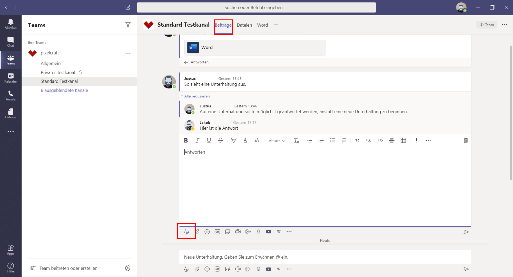

## Unterhaltungen [anleitung-unterhaltungen-20200907]

Der größte Teil der Kommunikation innerhalb von [Teams] findet in der sogenannten [Unterhaltung] statt.

[Unterhaltungen] Sind Teil eines jeden [Kanals] und unter der Registrierkarte [Beiträge] zu finden. Betreten Sie einen [Kanal], so ist dieser Reiter automatisch ausgewählt.

Wird eine [Unterhaltung] gestartet, können alle [Team]-Mitglieder und Zugangsberechtigte auf diese antworten oder eine eigene [Unterhaltung] starten. Dabei können sie neben Text auch Emojis, Gifs, Sticker, Bilder, Videos, Datei-Anhänge und App-Inhalte veröffentlichen.
Außerdem lassen sich Inhalte zur besseren Übersicht formatieren. Alle Optionen hierzu finden Sie über die Schaltfläche [A] unterhalb der Texteingabe.

Eine [Unterhaltung] folgt dem Prinzip eines Threads: Beiträge werden hierarchisch organisiert.

Der erste Beitrag einer [Unterhaltung] gibt das Thema vor, welchem die weiteren Beiträge folgen. Ist ein Thema für Einzelne nicht von Belang oder Interesse, kann so schneller über die Unterhaltung hinweggesehen werden, als es in einer Chat-Kommunikation mit durchlaufender, ungeordneter Gesprächsführung der Fall wäre.
Sie sollten darauf achten, die [Unterhaltungen] zu einem bestimmten Thema auch weiter für dieses zu nutzen. Greifen Sie für weitere Beiträge auf [Antworten] zurück, anstatt eine Antwort oder Fortsetzung des Themas durch eine [Neue Unterhaltung] anzugehen und den [Kanal] so unnötig aufzublasen.

Umfangreiche [Unterhaltungen] mit vielen Antworten werden zur verbesserten Übersicht zusammenklappt. Bei Bedarf können Sie diese wieder ausklappen.

Wenn Sie mit der Maus über einzelne Beiträge einer [Unterhaltung] fahren, öffnet sich rechts oben ein Emoji-Menü. Hier können Sie schnell mit einer symbolischen Emotion reagieren und so besonders unkompliziert Kenntnisnahme oder Feedback kommunizieren. Diese simple Funktion stellt sich als äußerst nützlichen Teil der Kommunikation dezentraler Arbeitsgruppen dar. Vor allem dann, wenn aus Zeitmangel oder anderen Gründen eine detailliertere Antwort nicht möglich ist. Die kurze Reaktion per Emoji kann den Austausch verstärken und darüber hinaus als Bindeglied im Kollegium fungieren: Jemand ist da, jemand nimmt wahr, jemand weiß zu schätzen.  

Im Menü [...] rechts neben den Emojis können Sie Nachrichten als Lesezeichen für später speichern oder per Link mit anderen Zugriffsberechtigten teilen.
Besonders die Funktion, Nachrichten zu speichern, ist nützlich, wenn Sie wichtige Unterhaltungen schnell wieder verfügbar machen oder fokussieren wollen. Zu den gespeicherten Nachrichten gelangen Sie über Ihr Profilbild oben rechts unter [Gespeichert]. Mit einem Klick auf das rote Lesezeichen-Symbol neben den einzelnen Nachrichten können Sie die Speicherungen wieder aufheben.

Die Kommunikation innerhalb eines [Kanals] ermöglicht es Ihnen, Information gezielt mit dem richtigen Personenkreis zu teilen, ohne anderen die Information aufzuzwingen oder überhaupt zugänglich zu machen. Sie können genau bestimmen, wer zu einem [Kanal] Zutritt hat und dort eine [Unterhaltung] beginnen kann.
Jedes Mitglied kann darüber hinaus bestimmen, wie die einzelnen [Kanäle] abgebildet werden: Ist ein [Kanal] für eine Weile nicht von Belang für eine Person, kann er ausgeblendet werden und so keine ungewollte Aufmerksamkeit provozieren.
Sie können auch eine E-Mail in eine Unterhaltung umwandeln und so in die Teams-Umgebung integrieren. Über die Schaltfläche [...] eines jeden [Kanals] können Sie dessen individuelle [E-Mail-Adresse abrufen]. Schicken Sie E-Mails an diese Adresse, werden diese inklusive Anhang im [Kanal] als [Unterhaltung] dargestellt. So können alle Mitglieder direkt im [Kanal] darauf antworten. Gleichzeitig werden die Anhänge der E-Mails im SharePoint gespeichert und bleiben so für alle verfügbar.

[weiter lesen: Chat](#anleitung-chat-20200907)
