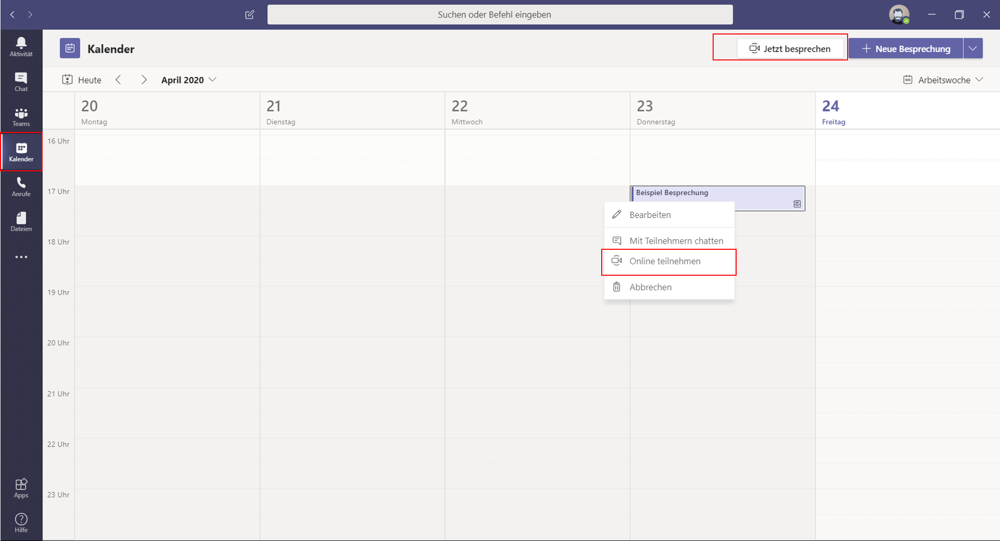

## Video-Telefonie [anleitung-video-20200907]

Teams hat ein interne Lösung für Telefonie mit und ohne Video. Diese steht vergleichbaren Anwendungen wie Skype for Business in nichts nach und ist laut Microsoft auch als dessen Nachfolge geplant, wenn Skype for Business im Sommer 2021 den Dienst einstellt.

In MS Teams können Sie [Anrufe] über die gleichnamige Schaltfläche in der linken Menü-Spalte starten. Aber auch aus [Chats] heraus oder über die Profilbilder Ihrer Kontaktperson.

Besonders praktisch sind [Anrufe] allerdings innerhalb einer [Besprechung], der Video-Konferenz der Teams-App. Sie können [Besprechungen] über den [Kalender], in der linken Menü-Leiste planen, finden und wahrnehmen.

Hinweise auf geplante [Besprechungen] und der Möglichkeit einer Teilnahme finden sich auch in den [Kanälen] wieder.

Jeder [Anruf] verfügt über einen eigenen [Chat].

Zudem haben Sie die Möglichkeit, den eigenen Bildschirm oder einzelne Programmfenster anderer Apps zu teilen.

Sie können [Anrufe] über den integrierten Dienst [Stream] aufzeichnen und teilen. Dies ist im Kontextmenü unter [weitere Aktionen] integriert und kann durch [Aufzeichnung beginnen] von Ihnen gestartet werden. Alle Teilnehmenden werden über die Aufzeichnung informiert. Im [Chat]-Bereich der [Besprechung] wird ebenfalls über die fertige Aufzeichnung informiert. Hier können Sie sich die Aufzeichnung auch außerhalb der Stream-App oder Stream-Web-Plattform ansehen.

Je nach Lizenz bietet Teams auch die Möglichkeit, per Telefon an [Besprechungen] teilzunehmen. Auf diesem Weg können Sie weitere Gäste und Team-Mitglieder ohne Internetanbindung in Ihr Gespräch integrieren.

Mittlerweile haben Sie in der Video-Telefonie in Teams auch die Möglichkeit, den Hintergrund Ihres Videos zu bestimmen. Im laufenden Gespräch erreichen Sie diese Funktion über die Schaltfläche [...] mit [Hintergrundeffekte anzeigen].

Neben einem Unschärfe-Effekt, mit dem Sie Ihren Hintergrund unkenntlich machen und so unerwünschte Einblicke in Ihre Umgebung verhindern, können Sie nun auch ohne zusätzliche technische Voraussetzungen eine Art Green-Screen-Effekt nutzen: Während Sie im Vordergrund sichtbar bleiben, wird Ihr Hintergrund durch eine Grafik ersetzt.

Teams bietet eine Auswahl vorgefertigter Hintergründe, um eine eigene Grafik in Teams zu integrieren, müssen Sie jedoch einen kleinen Umweg nehmen. Sie müssen die gewünschte Bilddatei in den entsprechenden lokalen Teams-Ordner einfügen.

In Windows erreichen Sie diesen Ordner über den Pfad [C:\Users\%USERNAME%\AppData\Roaming\Microsoft\Teams\Backgrounds\Uploads] oder indem Sie [%APPDATA%\Microsoft\Teams\Backgrounds] in das Startsuchfeld von Windows eingeben. Damit wird Ihnen der Ordner [Uploads] angezeigt, in welchen Sie die gewünschten Bilddateien kopieren müssen.

Unter MacOS finden Sie einen versteckten Ordner unter dem Pfad [~/Library/Application Support/Microsoft/Teams/Backgrounds/Uploads].
Bilder werden in Teams in 1920x1080 px dargestellt. Abweichende Formate werden automatisch zurechtgeschnitten.

Sie können diese und andere Einstellungen bereits vornehmen, bevor Sie einer [Besprechung] beitreten, denn bei jeder Teilnahme wird zunächst der Bereich der Audio- und Video-Einstellungen aufgerufen.

Nutzen Sie diesen Bereich und stellen Sie über die [Geräteeinstellungen] sicher, dass die gewünschte Kamera aktiviert ist und Sie gut zu verstehen sind. Dies erreichen Sie über das mit einem Zahnrad gekennzeichnete [PC-Mikrofon und Lautsprechereinstellungen].

Um zu überprüfen, ob alle vorgenommenen Einstellungen wie gewünscht funktionieren, können Sie einen kurzen [Testanruf führen].

Diese Überprüfung gibt jedoch keine genaue Auskunft über die tatsächliche Qualität Ihrer Video- und Audio-Signale, denn Microsoft bietet im Testanruf eine verminderte Bandbreite. Um die genaue Qualität Ihrer Ton- und Video-Spur zu ermitteln, welche die übrigen Teilnehmenden effektiv zu sehen und hören bekommen, bietet sich eine kurze Aufzeichnung einer [Besprechung] an.

Diese können Sie auch ohne weitere Teilnehmende immer starten, müssen beim Anlegen einer Besprechung über den [Kalender] allerdings mindestens eine weitere Person zur Besprechung einladen. Eine Aufzeichnung starten Sie, indem Sie in der laufenden [Besprechung] auf die Schaltfläche [...] klicken und dann [Aufzeichnung starten] wählen. An gleicher Stelle beenden Sie die Aufnahme wieder.

Die Aufzeichnung wird in Microsoft [Stream] gespeichert, dem [Besprechungschat] hinzugefügt und im [Kanal], in dem die Besprechung stattgefunden hat, als Aktivität dargestellt. Die Aufzeichnung wird zunächst verarbeitet. Es kann also eine Weile dauern, bis sie veröffentlicht und Ihnen und den übrigen Teilnehmenden zugänglich ist.

[weiter lesen: Benachrichtigungen](#anleitung-benachrichtigung-20200907)
