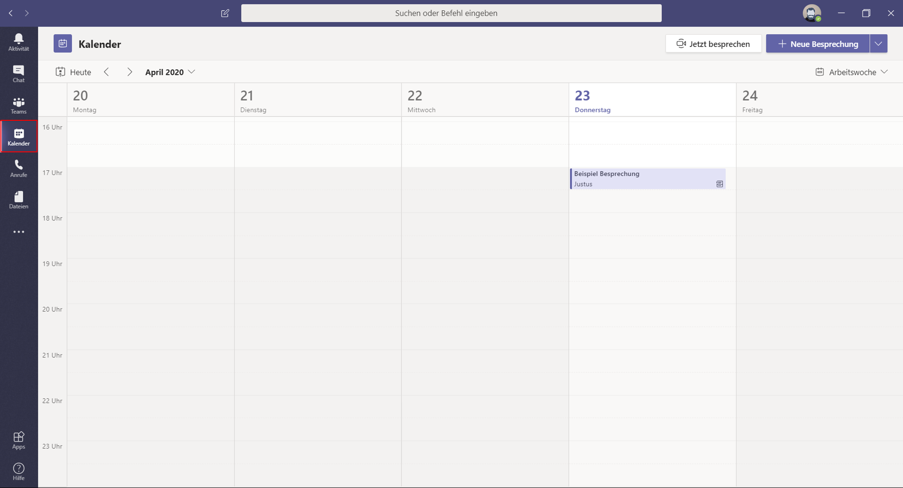
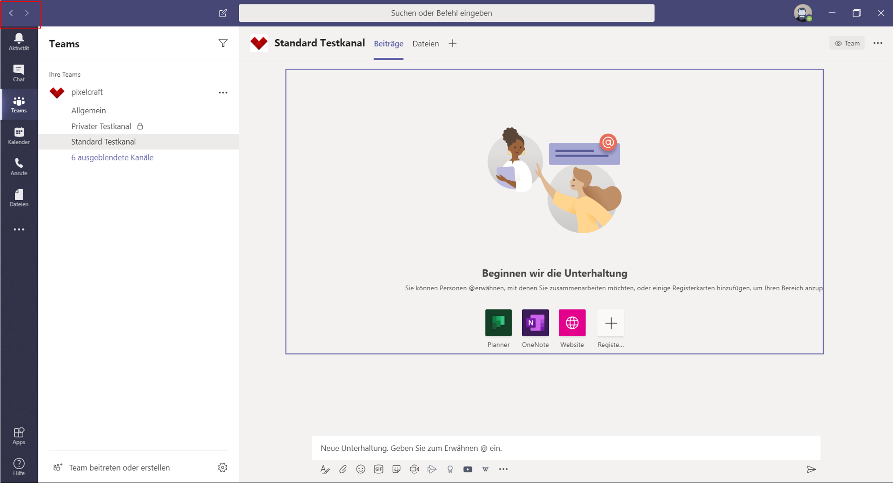
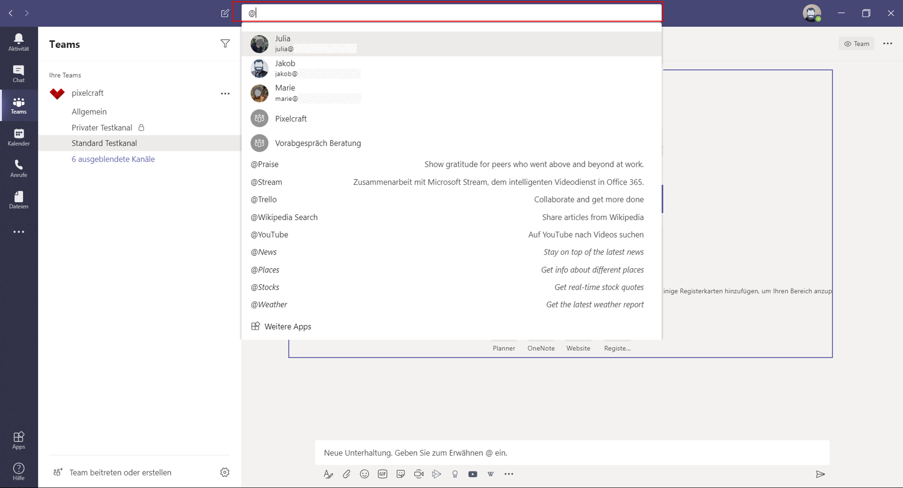
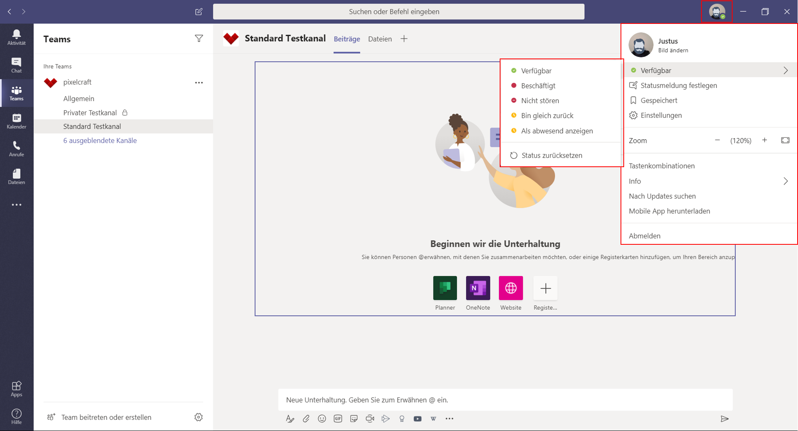

# Wie ist Teams aufgebaut? [anleitung-20200907]

Alle wichtigen Funktionen können Sie über die Schaltflächen in der linken Spalte erreichen. Wie Sie die jeweils nutzen, erklären wir in den folgenden Abschnitten noch genau. Aber hier ist ein erster Überblick.

**[Aktivität]** - Ein Feed, der Sie chronologisch über Erwähnungen, Nachrichten, Änderungen und weitere Vorgänge in Ihren [Teams] informiert.

**[Chat]** - Ermöglicht Ihnen den schnellen Austausch mit anderen Mitgliedern.

**[Teams]** - Listet alle [Teams] auf, an denen Sie beteiligt sind. Hierüber erreichen Sie auch deren zugehörige [Kanäle].

**[Kalender]** - Hier planen und betreten Sie Besprechungen.

**[Anrufe]** - Bietet die Möglichkeit, mit anderen per Video- oder Audio-Anruf zu kommunizieren. Auch Kontakte, Verläufe und eine Art Anrufbeantworter finden Sie hier.

**[Dateien]** - Hier finden Sie alle mit Ihnen geteilten Dateien.

In der linken Spalte, unterhalb der Hauptfunktionen, können Sie noch weitere Apps für den Schnellzugriff platzieren.

Die Kopfzeile bietet auf der linken Seite eine Navigationshilfe mit Vor- und Zurückfunktion. Diese ist besonders praktisch, um schnell wieder in den Bereich zurückzukommen, aus dem Sie, beispielsweise durch einen [Chat], herausgeraten sind. Mit einem Klick auf [<] gelangen Sie wieder dorthin zurück, ohne den Umweg über die Schaltflächen [Teams] und [Kanäle] nehmen zu müssen.

In der Mitte der Kopfzeile können Sie sowohl eine allgemeine Suche als auch Befehle ausführen.

Kurzbefehle dienen dazu, allgemeine Aufgaben in Teams zu erledigen. Um diese zu verwenden, geben Sie [/] in das Befehlsfeld ein. Daraufhin öffnet sich eine Liste mit einem Überblick über mögliche Befehle und deren Wortlaut.

Mit einem vorangestellten [@] vor einem Namen können Sie im Befehlsfeld Nachrichten direkt an einzelne Personen oder geteilte [Chats] senden.

Im rechten Bereich der Kopfzeile befindet sich ein rundes Profilbild. Hier können Sie all Ihre grundsätzlichen Einstellungen anpassen. Zum Beispiel können Sie den Status Ihrer aktuellen Erreichbarkeit ändern, der anderen Mitgliedern angezeigt wird.

[jetzt lesen](#anleitung-apps-20200907)
