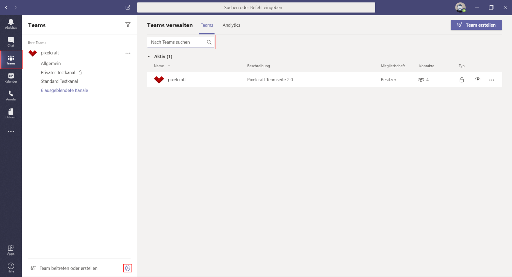
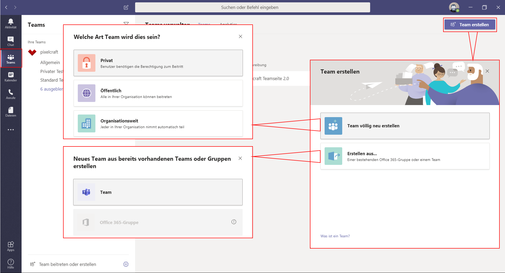

## Aufbau und Verwaltung von Teams [wozu-verwaltung-20200907]

Wer neue [Teams] in der App starten kann, bestimmen die Admins.
Im Sinne eines übersichtlichen Arbeitsumfelds lohnt es sich, im Vorhinein zu überlegen, ob allen Lizenz-Mitgliedern die Berechtigung erteilt wird, neue [Teams] anzulegen, oder ob dies in der Hand ausgewählter Personen liegen soll, wie etwa der IT-Abteilung oder der Administration.

Alle Berechtigungen innerhalb von Microsoft Teams lassen sich nach den eigenen Bedürfnissen bestimmen, was auch für Entscheidungen gilt, ob Emojis genutzt werden können, welche Apps hinzugefügt werden dürfen, wer [Kanäle] gründen und verwalten kann und vieles mehr.

Gründen Sie ein neues [Team], werden folgende Elemente automatisch erstellt:

- Eine neue Office-365-Gruppe
- Eine SharePoint-Online-Website und eine SharePoint-Online-Dokumenten-Bibliothek (hier werden die Dateien eines [Teams] gespeichert, jeder [Kanal] erhält hier seine eigene Dateiablage)
- Ein OneNote-Notizbuch für das [Team] (wird in SharePoint Online gespeichert)
- Ein Exchange-Online-Postfach
- Ein Exchange-Online-Kalender

Ein [Team], welches auf Basis einer bestehenden Office-365-Gruppe gegründet wird, übernimmt Mitgliedschaften, Website, Postfächer und Notizbuch der Gruppe und überführt diese in Microsoft Teams.

Bevor ein neues [Team] gegründet wird, muss der Name des [Teams] geprüft werden: Microsoft warnt Sie leider nicht davor, sollte ein [Team] mit gleichem Namen in Ihrer Organisation bereits bestehen. Das [Team] lässt sich zwar namensgleich gründen, die zugehörigen SharePoint-Bereiche dürfen jedoch nicht den gleichen Namen aufweisen. Microsoft würde in einem solchen Fall zufällige Zahlen an den neu geründeten Bereich mit gleichem Namen hängen, was zu großer Verwirrung führen kann:

Ein neues Team „Vertrieb“ bei bereits bestehendem Team „Vertrieb“, würde etwa seine Dateiablage unter https://beispiel.sharepoint.com/sites/Vertrieb314 finden. Die SharePoint-Team-Website und E-Mail-Adresse würden entsprechend inklusive der Zahlenfolge erscheinen. (Beispiel: https://beispielfirma.sharepoint.com/Sites/Vertrieb314)

Um herauszufinden, welche Namen bereits an bestehende [Teams] vergeben sind, können Sie in der Teams-App im Bereich [Teams] unten links über das Zahnrad-Symbol neben [Team beitreten oder erstellen] eine Übersicht aufrufen und durchsuchen.

Da auch die von Teams für Outlook erstellten E-Mail-Adressen von der ursprünglichen Namenswahl bestimmt sind, gilt es ebenso, auf eine allzu sperrige Benennung eines [Teams] zu verzichten. Wird das [Team] beim Erstellen etwa „das Team zur Evaluation Betatest“ genannt, so lautet die zugehörige E-Mail-Adresse „dasTeamZurEvaluationBetatest@yourdomain.com“.

Mit einem gefundenen Namen im Gepäck bestehen zwei Optionen, auf welcher Grundlage ein neues [Team] aufgebaut wird: Von Grund auf neu oder auf Grundlage einer bereits existierenden Office-365- oder Arbeitsgruppe.

Bei einem völlig neu erstellten [Team] müssen Sie zunächst bestimmen, wie neue Mitglieder in das [Team] gelangen können: Bei der Einstellung [Privat] müssen Mitarbeitende durch Sie eingeladen werden. [Öffentlich] können alle Mitglieder einer Organisation auf Wunsch beitreten, [Organisationsweit] wird die ganze Organisation automatisch Teil des [Teams].

Mit Gründung auf Basis einer Office-365-Gruppe können Sie auf bereits bestehende Strukturen und Einstellungen zurückgreifen.

Im letzten Schritt müssen Sie den [Team]-Mitgliedern Rollen zuweisen. Mögliche Rollen sind [Mitglied] und [Besitzer]. Es empfiehlt sich als Backup, pro [Team] die [Besitzer]-Rolle mehr als ein Mal zu vergeben. [Besitzer] können alle App-Einstellungen innerhalb ihres [Teams] verwalten.

[nächstes Kapitel: Aufbau von MS-Teams](#anleitung-20200907)
