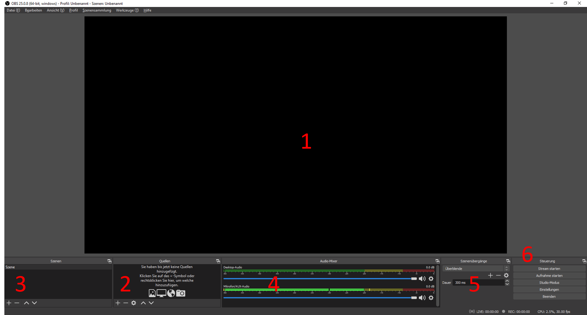

## Nutzungs-Oberfläche von OBS anpassen [obs-aufbau-20200909]

Um OBS als virtuelle Webcam zu nutzen, reicht eine Übersicht von dessen grundlegenden Funktionen und des optischen Aufbaus:

1.	Vorschaufenster: Hier wird Ihnen angezeigt, was in Ihrer Aufnahme oder Live-Übertragung effektiv dargestellt wird. Beim ersten Öffnen des Programms wird dieser Bereich schwarz dargestellt, da Sie noch keine Inhalte wie Bilder, Videos, Webcams, Browser-Darstellungen, Präsentationen, Bildschirm-Aufnahmen oder weiteres eingefügt haben. All diese Inhalte, die Sie darstellen und aufzeichnen wollen, werden Quellen genannt.
2.	Quellen: In diesem Bereich können Sie Quellen, also Inhalte, als einzelne Elemente hinzufügen. Hierüber zugefügte Elemente werden schließlich im großen Vorschaufenster angezeigt. Neben visuellen Quellen fügen Sie hier auch Audio-Quellen hinzu.
3.	Szenen: Szenen können als optische Vorlagen betrachtet werden, denn in diesem Bereich können Sie verschiedene optische Arrangements Ihrer eingefügten Quellen speichern und immer wieder darauf zugreifen. Haben Sie mehrere Quellen eingefügt, können Sie diese in Ihrem Vorschaufenster nach Ihren Vorstellungen anordnen und als Szene speichern. Soll etwa Ihr Webcam-Bild als kleines Fenster unten links vor einer Präsentation erscheinen, so können Sie sich diesen Aufbau im Vorschaufenster zurechtlegen, als Szene speichern und später immer wieder verwenden.
4.	Audio Mixer: Hier wird Ihnen angezeigt, ob Audio-Elemente wie Mikrofon-Aufzeichnungen in OBS ankommen. Bewegungen der farblichen Balken zeigen an, ob die Audio-Ausgabe zu laut oder zu leise ist. Außerdem können Sie hier ungewollte Audio-Spuren herausfiltern.
5.	Szenen-Übergänge: Dieser Bereich ist nur für die fortgeschrittene Anwendung wichtig. Hier können Sie den Wechsel zwischen mehreren angelegten Szenen gestalten.
6.	Steuerung: Hier starten und stoppen Sie Ihre Aufnahme.

[weiter lesen: Quellen einfügen](#obs-quellen-20200909)
