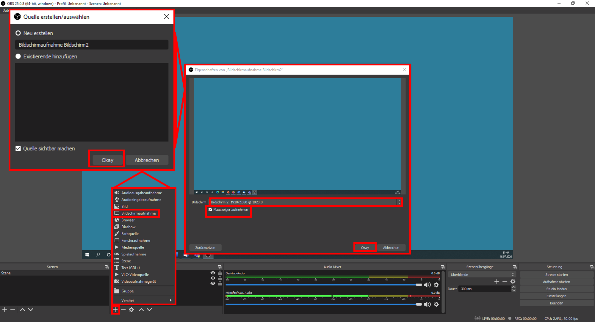

## Den Desktop als Quelle einfügen [obs-desktop-20200909]

Eine der Quellen, die Sie einfügen können, ist die [Bildschirmaufnahme]. Die zeigt alles, was auf Ihrem Bildschirm dargestellt wird. Sofern Sie wollen, inklusive Ihrer Maus-Bewegungen. Es bietet sich hierfür an, einen zweiten Bildschirm zu nutzen. Dann können Sie auswählen, welcher Bildschirm gezeigt wird, während Sie auf dem anderen OBS oder andere Anwendungen steuern, die Sie nicht darstellen wollen.

Auch eine [Bildschirmaufnahme] fügen Sie im Bereich [Quellen] über das [+] ein. Wählen Sie die Option aus der Liste, benennen Sie die Quelle eindeutig („Bildschirm1“/ „Bildschirm2“) und bestimmen über die Pfeile, welcher Bildschirm abgebildet werden soll. Mit einem Häkchen haben Sie die Möglichkeit, zu entscheiden, ob Ihre Maus-Bewegungen sichtbar sein sollen oder nicht.

Die Bildschirmaufnahme wird dann auf dem Vorschaufenster dargestellt und kann wie alle visuellen Quellen in der Darstellung angepasst werden.

[weiter lesen: Programm als Quelle](#obs-programm-20200909)
